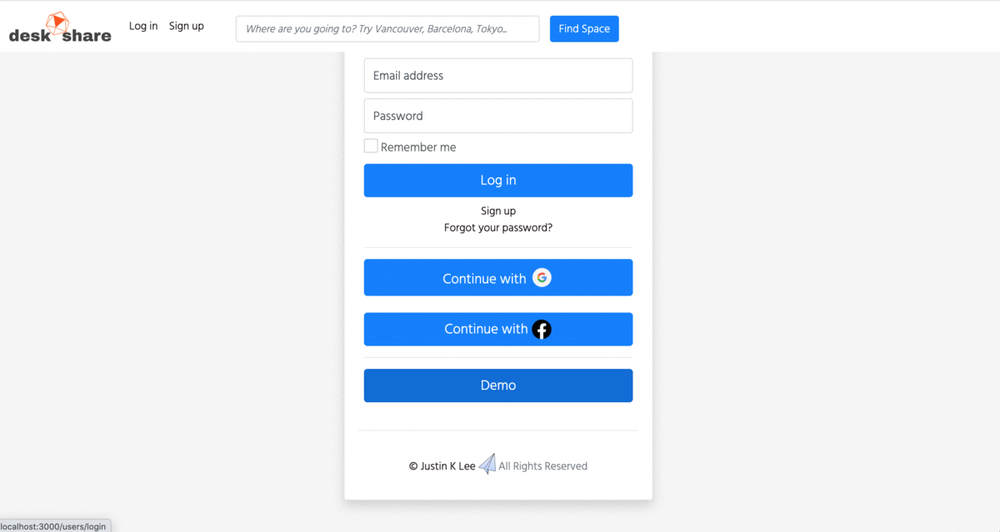

# Share Desk 2025 - Enhanced Version

### Live site: https://sharedesk.onrender.com/



---

## 🚀 What's New in 2025 Version

The 2025 Share Desk is a complete rebuild and enhancement of the original 2020 Share Desk application, featuring modern Rails 7 architecture, improved user experience, and enhanced functionality.

### Key Improvements:
- **Rails 7.1.5.1** with modern architecture
- **Enhanced Google Maps integration** with backup systems
- **Improved location detection** and consent management
- **Better responsive design** and mobile experience
- **Enhanced security** and performance optimizations
- **Modern JavaScript** with Stimulus controllers
- **Improved error handling** and user feedback

---

## 🛠 Technology Stack (2025)

### Backend
- **Ruby on Rails 7.1.5.1** - Modern Rails with importmaps
- **Ruby 3.3.0** - Latest Ruby version
- **PostgreSQL** - Production database
- **Redis** - Caching and session storage

### Frontend
- **Stimulus.js** - Modern JavaScript framework
- **Bootstrap 5** - Responsive UI framework
- **Importmaps** - Modern JavaScript module system
- **Turbo** - Fast navigation and form handling

### External Services
- **Google Maps API** - Location services and mapping
- **Google OAuth2** - Social authentication
- **Facebook OAuth** - Social authentication
- **AWS S3** - File storage and image hosting
- **Render.com** - Cloud hosting platform

### Gems & Libraries
- **Devise** - Authentication system
- **Pagy** - Fast pagination
- **Ransack** - Advanced search functionality
- **Active Storage** - File attachment handling
- **Geocoder** - Location services
- **OmniAuth** - Social login integration

---

## 🎯 Enhanced Features (2025)

### 🗺️ Advanced Location Services
- **Smart Location Detection**: Automatic location detection with user consent
- **Fallback Systems**: Multiple location detection methods (IP, browser geolocation)
- **Location Consent Management**: User-friendly location permission handling
- **Enhanced Google Maps**: Backup systems for reliable map functionality
- **Real-time Location Updates**: Dynamic location updates without page refresh

### 🔐 Improved Authentication
- **Enhanced OAuth Integration**: Seamless Google and Facebook login
- **Better Security**: Improved session management and security protocols
- **User Profile Management**: Enhanced profile editing with avatar support
- **Demo User Support**: Special demo account with enhanced features

### 🏠 Enhanced Workspace Management
- **Improved Room Creation**: Enhanced form with better validation
- **Advanced Search**: More sophisticated search with multiple filters
- **Better Image Management**: Enhanced image upload and display
- **Location-based Filtering**: Smart filtering based on user location

### 📱 Mobile-First Design
- **Responsive Navigation**: Mobile-optimized navigation drawer
- **Touch-Friendly Interface**: Optimized for mobile devices
- **Progressive Web App Features**: Enhanced mobile experience
- **Cross-Platform Compatibility**: Works seamlessly across all devices

### 🎨 Modern UI/UX
- **Clean Design**: Modern, minimalist interface
- **Improved Typography**: Better readability and visual hierarchy
- **Enhanced Animations**: Smooth transitions and interactions
- **Accessibility Improvements**: Better accessibility features

---

## 🚀 Deployment & Infrastructure

### Production Environment
- **Render.com**: Modern cloud hosting platform
- **PostgreSQL**: Production database
- **Redis**: Caching and session storage
- **AWS S3**: File storage and CDN
- **Custom Domain**: Professional domain setup

### Development Environment
- **Local Development**: Easy local setup with Docker support
- **Environment Variables**: Secure configuration management
- **Database Seeding**: Comprehensive seed data for testing
- **Debug Tools**: Enhanced debugging and logging

---

## 📊 Performance Improvements

### Speed Optimizations
- **Asset Optimization**: Compressed and optimized assets
- **Database Indexing**: Improved query performance
- **Caching Strategy**: Smart caching for better performance
- **CDN Integration**: Fast content delivery

### Reliability Enhancements
- **Error Handling**: Comprehensive error handling and recovery
- **Backup Systems**: Multiple fallback systems for critical features
- **Monitoring**: Enhanced logging and monitoring
- **Graceful Degradation**: App continues to work even if some features fail

---

## 🔧 Development & Maintenance

### Code Quality
- **Modern Rails Practices**: Following Rails 7 best practices
- **Clean Architecture**: Well-organized code structure
- **Comprehensive Testing**: Enhanced test coverage
- **Documentation**: Detailed code documentation

### Maintenance Features
- **Easy Updates**: Streamlined update process
- **Database Management**: Improved database maintenance
- **Security Updates**: Regular security patches
- **Performance Monitoring**: Continuous performance tracking

---

## 🌟 Future Roadmap

### Planned Features
- **Real-time Chat**: In-app messaging between hosts and guests
- **Payment Integration**: Secure payment processing
- **Advanced Analytics**: Detailed usage analytics
- **API Development**: RESTful API for mobile apps
- **Multi-language Support**: Internationalization
- **Advanced Notifications**: Push notifications and email alerts

### Technical Improvements
- **Microservices Architecture**: Scalable service architecture
- **Machine Learning**: Smart recommendations and pricing
- **Advanced Search**: AI-powered search and filtering
- **Mobile App**: Native mobile applications

---

## 📝 Installation & Setup

### Prerequisites
- Ruby 3.3.0+
- Rails 7.1.5.1+
- PostgreSQL 12+
- Node.js 18+

### Quick Start
```bash
# Clone the repository
git clone https://github.com/DevNeoLee/Sharedesk2025.git
cd Sharedesk2025

# Install dependencies
bundle install
npm install

# Setup database
rails db:create
rails db:migrate
rails db:seed

# Start the server
rails server
```

### Environment Variables
Create a `.env` file with the following variables:
```env
MAPS_API_KEY=your_google_maps_api_key
GOOGLE_CLIENT_ID=your_google_oauth_client_id
GOOGLE_CLIENT_SECRET=your_google_oauth_client_secret
FACEBOOK_CLIENT_ID=your_facebook_app_id
FACEBOOK_CLIENT_SECRET=your_facebook_app_secret
AWS_ACCESS_KEY_ID=your_aws_access_key
AWS_SECRET_ACCESS_KEY=your_aws_secret_key
S3_BUCKET_NAME=your_s3_bucket_name
```

---

## 🤝 Contributing

We welcome contributions! Please see our contributing guidelines for more details.

---

## 📄 License

MIT © Justin K Lee

---

## 🙏 Acknowledgments

- Original 2020 Share Desk team
- Rails community for continuous improvements
- Open source contributors
- Beta testers and early adopters

-------------------------------------------------------------- previous version ---------------------------------------

# Share Desk App

### live site: https://sharedesk1.onrender.com/


---
## Technology

- Ruby on Rails 6.0

- Javascript

- JQuery

- PostgreSQL

- AWS S3 

- Bootstrap

- Turbolink/Stimulus.js

- Omniauth(Facebook/Google)

- Google Map API / Geocode

- Devise/ Raty/ Ransack/ Active_Storage/ Pagy/ JQuery UI/ Datepicker/ Toastr

- SASS

- Webpack

- HTML5

---
## Motivation

This application aims at a web product which serve local community by hosting your private home/office for public work space and share with community around the world in any city. It started with the fact that we have a lack of public space for work and study in local community because of COVID pandemic 2020.

Inspired by WeWork and Air B&B.

User can sign up their home/office space for rental business. Customers can search their local area for available shared work spots near by.

---

## Features

### User Account/ Profile Update with an Avatar

Anyone can do regular search for the available spaces, however, for advanced features such as making a reservation or hosting spaces, users should sign up and create account. Account could be created using Omniauth from Facebook/Google Account with just a click as well as regular sign up using your email address. Devise gem was used for more sophisticated authorization, and login/signup process.

Profile page illustrates user information with a user photo or avatar and shows all the hosting space list. User can update all of their information anytime easily.

### Upload Photos to AWS S3

Currently the app was deployed to Heroku.com, and for the limitation of long term storing photo datas, cloud file uploading AWS/S3 was used with Acitive_Storage Rails gem for easy image saving and loading. Image_Processing gem was used for manipulation of photos as well.

### Hosting your home / apartment for workspace rental

User can host their own home/apartment/office for desk renting business. Space was categorized in single private desk, shared large table, or private room. User can price reasonably on their own for local supply and demand. Creating page was provided with detailed categorized form with various inputs including uploading many images for the space. After the listing, managing page was provided with total sales and reserved detail page as well.

### Locating the address on Google Map

Google Map API was used to locate your hosting address on the map interactively. Individual space page also shows the description of the space along with the google map pointer.

### Advance Searching in Detail

As well as the navbar serching ability on any page, advanced detailed search feature was introduced. User can select differenct specific needs accordingly. Rails gem Ransack was chosen to implement sophistecated multiple keyward searching through the backend database.

### Rating Reviews with Star System

Visually recognied star rating sytem was used for customers who reserved and experienced its service to write feedback and rate the satisfaction level with easily implementing gem Raty. Average rating of the spaces could be seen beside the title of the space at first.

### Make Reservation with Datepicker

JavaScript and Ajax call was used for selecting a reservation day and creating it. User can reverve starting day and finishing for more than one day ahead of time.
JQuery Datepicker plugin was also used. A little complicated business logic was needed to implement to set up the available date based on the availablilty and starting/ending dates. JavaScript was essential to call backend 'reservation' model to work on the background smoothly and promptly.

### Local Searching based on Customer Browser Location

Geocode gem was used to detect the local location of the user browser so the local area availability searching was provided just with a button click on home page.

### Convinient Login using Omniauth(Google/Facebook)

Devise gem was used together with omniauth authentification from preset Google/Facebook services when authentification call was reached from Sharedesk url address.

### Notification with Toastr

Toastre gem was used for more informative notification services including different color notices, exposure/dissapearing time.

### Infinite Scrolling for Search Result using Ajax javascript call

Stimulus.js was used to listen html events on the web service. Particularly it was used for infinite scrolling when next page of search results need to be Ajax called and the data needed to be loaded easily as soon as the scrolling down event was reached at certail point on the bottom. Stimulus also listen to the event for finishing up the infinite scrolling when it reached the last item on the result.

### Pagination for each page with pagy gem

Simple pagination gem Pagy was used to implement organization of the different lists with different amount of list/page to show on each page.

---
## Future Features to Come

- Emailing notification
- API location using Jbuilder for React/Redux
- Hourly reservation
- Conversation(chatting) between customers and hosts
- Payment system 
---
## License ##
MIT © Justin K Lee

